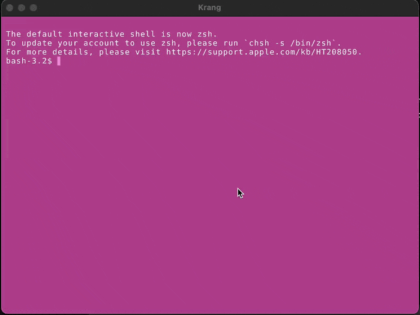

# Krang

<div style="display: flex;">
  <div style="margin-right:2em;">
    
  </div>
  <div style="font-size: 30px;">
  "The Technodrome is almost fully operational, and once it is, the world will tremble before the might of Krang, ruler of all that I survey!""
  </div>
</div>

_I mean..._

# Krang

A cross-platform tiling terminal emulator that can be extended with UI plugins (Ruby).



## How does it work?

Krang is built with [hokusai-pocket](https://github.com/skinnyjames/hokusai-pocket), which is GUI framework using MRuby/Raylib.

In hokusai-pocket, a gui is evaluated at runtime, which has implications on scriptability of desktop programs.  [see docs](https://hokusai.skinnyjames.net).

Plugins are defined as subclasses of `Hokusai::Block` and can register under keyword that can be invoked with a special shell script: `kg`

In the terminal PTY, when a user types something like 

```shell
ls *.png | kg img | xargs rm
```

The kg shell script sends an ANSI OSC sequence to the GUI, which looks for a plugin registered to `img`.  If it exists, the plugin is mounted and its `on_ready` method will be invoked with the calling directory, the payload argument, and a block callback for returning a reply.

For an example, see the bundled [image plugin](assets/plugins/image/manifest.rb)

## Tiling

Still working out the best ways to not interfere with different system keys

* `super + d` or `alt + ctrl + d` New session to right
* `super + shift + d` or `alt + ctrl + shift + d` New session to the bottom
* `super + arrow keys` move tiles
* `super + w` close session

## Styling

Krang reads a json file for it's styles located under assets/theme.json.  Feel free to modify these (or better, write a plugin to do it!)

## Downloading

For now I'm hosting [pre-built binaries on Google Drive](https://drive.google.com/drive/folders/1v0WGQJQX60c2TOQqOT4ZwSB4aZOpBqdI?usp=drive_link)

## Building from source

1. Grab a fresh `hokusai-pocket` release
2. Clone this repo, and run `hokusai-pocket @rebuild`.  Hokusai pocket will build a new binary containing the attached mruby-pty gem.
3. run `./bin/hokusai-pocket run:target=krang.rb`

## Security?

Yeah for sure.  Don't run arbitrary plugins, especially from sources you don't trust.  In fact, you should write your own! hokusai-pocket makes it easy.

## AI Usage

This was my first real project that I [revisited](https://github.com/skinnyjames/trollio-console) using an LLM.  It's not very big.

Although it generated different decisions than I would (sometimes for better, sometimes for worse), the code is readable and it was very helpful in teasing out the numerous cases with ANSI escapes, cross-platform edge cases, and the pty grid.  I also helped out :)

I would love to dig into this project with the community and be schooled on ANSI and ANSI extensions.  (American National Standards Institute - _how many times have i colorized text without knowing that?_)

Let's talk in the issues or dicussions.

In short, I wanted to make something to prove the viability of writing efficient and interesting desktop applications with hokusai-pocket, which is and will stay hand coded. (_for better or worse_).

## Contributing

Let's start with questions and discussions about design decisions, historical references, and terminals in general. 
This leans more POC than PRODUCT, so I want to gain more out of this experience than pushing changes.

The hokusai pocket docs are also great place to start for writing plugins.

## License

This is sort of messed up huh.  I never believed in digital IP as a teen, because it's just information.  Enter Napster and the shutting down of so many good projects (remember grooveshark?).  Anyway, as an adult I learned to license projects, but then somebody pointed an opaque process at tons of GPL code to nudge weights in a statistical model which produces work that the courts don't think is derivative based on the same logic I had as a teenager.  

Taking mandates/suggestions here.

## For 1 cup of coffee a day...

I spend a lot of time [writing software](https://github.com/skinnyjames), considering [equitable economics](https://proposal.skinnyjames.net), and even making [original](https://pigsfly.skinnyjames.net) [art](https://drawing.skinnyjames.net).

In order to preserve a class of intention that otherwise couldn't be preserved by working for a tech company, I work part time at a Red Lobster.  I'm happy and it the work is good, but if you suppose my time would be better spent sustaining development efforts or getting a worker cooperative off the ground, please consider sponsoring me.

If you think I'd be of more value at Red Lobster, please come see me too and get a lobster shrimp pasta or something.
